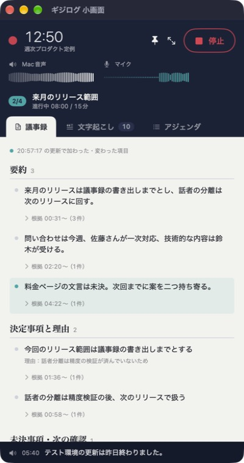
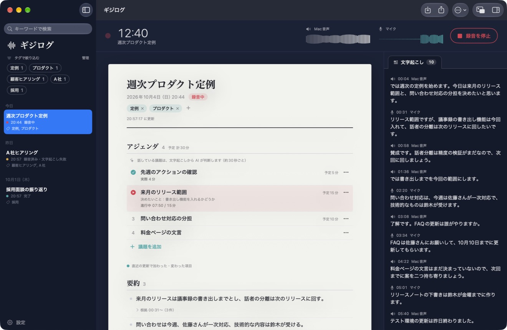

# Gijilog (ギジログ)

A macOS app that writes meeting minutes while your video call is still going.
Keep its compact window next to the call to see what has been decided, what is still open, and who owns each task.

[日本語](README.md)

> [!NOTE]
> The interface and the generated minutes are in Japanese.

<p>
  
  
</p>

## Features

- **Records any call**: captures the Mac's audio output and your microphone as separate tracks while you stay in Zoom, Teams, Google Meet, or any other app. Your meeting app's settings are left alone, and no screen recording permission is needed.
- **Live minutes**: transcribes with OpenAI at pauses in speech (every 10–25 seconds) and extends the minutes every 30 seconds. Audio without a voice is not sent, and the meeting title, agenda, a vocabulary list (Settings → 文字起こし), and the preceding speech are given as hints, so names and sentences hold together.
- **Made for running the meeting**: the compact window lists decisions, open questions, and action items, highlights what the latest update changed, and flags actions that still lack an owner or a deadline. A tab switches it to the full transcript, which follows the newest speech.
- **Grounded in what was said**: every item links to the time of the utterances behind it. Items without supporting utterances, and owners or deadlines nobody said, are left out.
- **From existing recordings too**: import a Voice Memo, a Zoom recording, or any audio or video file and get the same minutes afterward.
- **Audio and minutes together**: each meeting gets a folder with `議事録.md` (minutes) and `録音.m4a` (audio).
- **Tags**: tag meetings and narrow the list to the ones you need.
- **Agenda**: prepare the topics before the meeting; during it, the AI follows which topic is being discussed from the transcript and the compact window shows it with its time. The minutes record how long each topic took.
- **Keyword search**: search titles, tags, minutes, and transcripts at once, with every match marked.
- **Edit the minutes**: click an item to change it. Fixing a misheard name offers to fix it across the meeting, including other spellings that read the same (森バス and もりばす for モリバス).
- **Use from AI apps (MCP)**: ask Claude Code, Claude Desktop, or another MCP client "What did we decide in last week's sync?" or "Which actions are still open?" Everything stays on your Mac.

## Requirements

- macOS 15 or later
- An OpenAI API key (you pay for your own usage)
- To build: Swift 6 or later (Xcode or the Command Line Tools) and [SwiftLint](https://github.com/realm/SwiftLint)

## Getting started

```sh
brew install swiftlint
git clone https://github.com/nutcase/gijilog.git
cd gijilog
./scripts/build.sh
open dist/ギジログ.app
```

1. Open Settings (⌘,) and save your OpenAI API key.
2. Click 新規録音 (New recording) in the toolbar to start recording a new meeting and writing its minutes. The first time, macOS asks to let the app record the microphone and system audio (the sound your Mac plays); allow both. No screen recording permission is needed.
3. A meeting is titled by its start time. Click the title above its minutes to rename it (Return to finish, Esc to undo).

Where you click decides what is recorded: 新規録音 (New recording) in the toolbar, or ⌘⇧R, always records a new meeting; a prepared meeting's page has この会議を録音 (Record this meeting); a finished meeting's page has 続けて録音 (Continue recording, also in the meeting menu); and アジェンダを準備 (Prepare agenda) above the list, or ⌘N, creates a meeting before recording it. A continued meeting's clock runs on from its earlier part, the transcript and minutes grow, and stopping joins both parts into one `録音.m4a` and reviews the whole meeting again.

You can also start and stop from the menu bar icon (a waveform, or a record mark while recording) or the app's 録音 menu (⌘⇧R), even with every window closed.

| Shortcut | Action |
| --- | --- |
| ⌘⇧R | Start or stop recording |
| ⌘N | Prepare an agenda (create a meeting before recording it) |
| ⌘O | Import a recording file |
| ⌘F | Search meetings |
| ⌥⌘F / ⇧⌘F | Find in the open meeting's minutes / transcript |
| ⌘1 / ⌘2 / ⌘3 | Compact window tabs: minutes, transcript, agenda |
| ⌘, | Settings |

> [!NOTE]
> Builds are signed ad hoc by default, so every rebuild loses the recording permission, and reading the saved API key asks for Keychain access again (click Always Allow). Clear the stale permission and repeat step 2:
>
> ```sh
> tccutil reset AudioCapture io.github.nutcase.gijilog
> ```
>
> You can change the permission later under System Settings → Privacy & Security → Screen & System Audio Recording → System Audio Recording Only. If the Mac audio waveform stays flat, check it there.
>
> To keep the permission across rebuilds, create a self-signed code-signing certificate in Keychain Access (Certificate Assistant → Create a Certificate, identity type Self-Signed Root, certificate type Code Signing) and build with `GIJILOG_SIGN_IDENTITY="<certificate name>" ./scripts/build.sh`.

## Decision-focused minutes

Minutes include decision reasons, the next checks needed for unresolved issues, and the history of changed or withdrawn plans. Action items come last; unsupported owners and deadlines remain unassigned. Expand an item's evidence to read its timestamped source utterances.

Live updates remain on a 30-second timer. After recording and transcription finish, the whole transcript and the live draft go to the model at once, and the minutes are rewritten from start to finish: one summary item per topic, written "topic：conclusion" with the topic in bold in the app and in `議事録.md`, conclusions first, no reported speech or notes about what was not said (meetings over about four hours are rewritten in checkpointed parts). `議事録.md` lists the summary, decisions, action items, open issues, and then the transcript, with times such as 40:24. This uses additional API calls. Failed reviews keep the draft and can resume. The meeting menu also offers “議事録を仕上げる” to refine a saved transcript without transcribing or uploading the audio again. Completed older meetings are not automatically reprocessed. Semantic quality still needs evaluation on real meetings; source-ID and timestamp checks alone do not prove that a conclusion or rationale is correct.

## Editing the minutes

The transcript beside the minutes can be corrected too, also while recording: click an utterance to edit it, or right-click to delete one, such as a line invented for noise. Run 議事録を仕上げる to carry transcript fixes into the minutes.

Once a meeting is finished, click an item in the full window to edit it (Return to finish, Esc to cancel); actions also take an owner, a deadline, and a done mark. Right-click an item to delete it, or use ＋ 追加 (Add) under a section. Items edited by hand are marked 手直し and are kept as they are by 議事録を仕上げる and a full reprocess; deleted items are not brought back.

When an edit to an item or an utterance changes a word that appears elsewhere in the meeting, the app offers to fix the others too, or use この会議 → 語句をまとめて直す… (Fix a word across the meeting). Occurrences are found by spelling and by reading, looked up on the Mac, each shown in context with a checkbox. The fix is remembered for the meeting and applied to speech transcribed later and minutes the AI writes later; the right spelling becomes a transcription hint and, if you choose, joins the vocabulary list. Fixes can be undone from the same sheet.

## Tags

Click タグを追加 (Add tag) under a meeting's title, type a tag, and press Return; separate several tags with commas. Tags you used before are offered as suggestions, and right-clicking a meeting in the list opens a タグ (Tags) submenu.

Click tags at the top of the list to show only the meetings that have all of them; 解除 (Clear) shows every meeting again. To rename or delete a tag on every meeting at once, open the タグ (Tags) tab in Settings, or click 管理 (Manage) above the tags. Renaming a tag to another tag's name merges the two; deleting a tag leaves the meetings in place. Tags that differ only in letter case or in full-width and half-width characters count as one tag. Tags are also written under the title in `議事録.md`. Starting a recording or importing a file clears the filter so the new meeting stays in view.

## Agenda

Click アジェンダを準備 (Prepare agenda) above the list, or press ⌘N, to create a meeting before recording it; the list shows it as 準備中 (prepared). Type a topic and press Return, or paste a calendar invite or a bulleted list to add one topic per line. Bullets and numbering are removed, and a trailing length such as "（10分）" or "15 min" becomes the planned time. Click a topic to edit its title, its goal, or its planned minutes.

When the meeting starts, click この会議を録音 (Record this meeting) on the prepared meeting's page. With each minutes update (about every 30 seconds, no extra API calls) the AI judges which topic the newest speech is about, so nobody switches topics by hand; a topic starts at the utterance where its talk began, and returning to a topic adds to its time. The elapsed time changes color past the planned time, and stopping the recording ends the topic under way. `議事録.md` lists the agenda with the planned and actual time of each topic. An agenda is optional: recording without one works as before.

## Keyword search

Type in the search field above the list (⌘F) to show only the meetings whose title, tags, minutes, or transcript contain your keywords; each meeting shows an excerpt of the match. Separate keywords with spaces to find meetings that contain all of them. Letter case and full-width or half-width characters are ignored, and search combines with the tag filter. Opening a meeting marks the matches in its minutes and transcript and scrolls the transcript to the first one.

Inside the open meeting, the minutes (the magnifier on the date line, or ⌥⌘F) and the transcript (the magnifier in its header, or ⇧⌘F) each have their own find bar. It shows how many items or utterances match and which one you are on (such as 3/12); Return or ↓ goes to the next match, ↑ to the previous one, and Esc closes it.

## Use from AI apps (MCP)

AI apps that support MCP, such as Claude Code and Claude Desktop, can read your meetings.

1. In Settings → AI 連携, click Claude Code に追加 (Add to Claude Code) or Claude Desktop に追加 (Add to Claude Desktop), once. Claude Code is registered with `claude mcp add` (the command is copied if `claude` cannot be found); Claude Desktop opens an extension (`ギジログ.mcpb`) to install. For other apps, register the command shown there (`ギジログ.app/Contents/MacOS/gijilog-mcp`) as a stdio MCP server, or copy the JSON configuration.
2. Then just ask. ギジログ starts in the background if it is not running, and the connection comes back on the next question if it quits.

The Claude Desktop extension also works in the Claude desktop app's Code tab (Claude Code). To unregister, remove the extension under Settings → Extensions in Claude Desktop, or run `claude mcp remove --scope user gijilog` for Claude Code.

Tools: `list_meetings` (by date range and tag), `search_meetings` (keyword search returning every matching passage, with times for transcript lines; all space-separated keywords must appear), `get_meeting` (minutes with reasons, open questions, actions, and agenda), `get_transcript` (by time range, in pages), `list_action_items` (across meetings, by status and owner), `get_current_meeting` (the meeting being recorded and its current topic), and `list_tags`. All tools only read; nothing deletes meetings or starts or stops recording.

ギジログ listens on a Unix socket only you can open (`~/Library/Application Support/Gijilog/mcp.sock`) and opens no network port. What an AI app reads is sent to that app's provider: you can withhold transcripts, hide meetings by tag, see recent tool calls, or turn the feature off in the same Settings tab.

## Minutes from a recording file

Click 読み込み (Import) in the toolbar (⌘O) or drop audio or video files on the window. Each file is cut at pauses like a live recording, transcribed, and then summarized into minutes. All audio tracks are mixed, and importing never blocks stopping a recording. The meeting takes the file's name and creation date, and its folder gets `議事録.md` and `録音.m4a`; the original file is left as is.

## Where meetings are saved

By default in `~/Documents/ギジログ`, one folder per meeting. You can choose another folder in Settings; existing meetings move with it.

```text
~/Documents/ギジログ/
└── 2026-10-03 17.26 Weekly sync/
    ├── 議事録.md        minutes and transcript, rewritten as the meeting changes
    ├── 録音.m4a         Mac audio and microphone mixed for listening back, written after recording stops
    ├── chunks/          working audio: the recording cut into ~12-second pieces for transcription
    ├── recording.json   the rest is the app's own data
    └── meeting.json
```

While a meeting is recorded and processed, the working audio takes about 230 MB per hour. Once the minutes are complete and `録音.m4a` exists, it is deleted automatically, leaving about 10 MB per hour (you can turn this off in Settings). Settings also shows how much space the save location uses and can clean up the working audio of earlier complete meetings. A full reprocess of a meeting without working audio transcribes `録音.m4a` again, without separating the Mac audio and the microphone.

## Privacy and consent

- **Sent to OpenAI**: audio cut at pauses (stretches without a voice are skipped), transcription hints (the meeting title, agenda topics, your vocabulary list, and the preceding speech), the transcript text, the minutes so far, and, while recording, the agenda (topics and goals). Tags are not sent. Minutes are requested with `store: false`.
- **Kept on your Mac**: recordings, transcripts, minutes, agendas, and tags.
- **Given to AI apps over MCP**: the minutes, agendas, and transcripts the app asks for (transcripts and meetings with chosen tags can be withheld), which the app sends to its provider. The API key stays in the Keychain and is never written to meeting files.
- **Consent**: tell participants and get their consent before recording or transcribing a meeting, and follow the laws and policies that apply to you.
- **Review**: the minutes are an AI summary. Check anything important against the transcript.

If your Documents folder syncs with iCloud Drive, recordings are uploaded too.

## Limitations

- No speaker identification: "Mac音声" and "マイク" are where the sound came from, not who spoke.
- Playing the call through speakers records it twice through the microphone. Use headphones.
- 30 seconds is the update interval, not a guarantee; slow networks or APIs delay updates.
- The current agenda topic is judged with these updates, so it changes about 30 seconds after the talk moves on, and as an AI judgment it can be wrong.
- Very long meetings send the growing minutes each time and can approach the model's input limit.
- No Developer ID signing or notarization yet: build from source.

## Development

```sh
./scripts/check.sh   # format check, SwiftLint, regression tests, release build
./scripts/format.sh  # format the Swift sources
./scripts/test.sh    # regression tests only
./scripts/build.sh   # build dist/ギジログ.app after the checks pass
```

The 75 regression tests cover continued recordings, chunking at pauses and the shared recording clock, the voice gate and transcription hints, hand edits and word corrections, incremental minutes and evidence checks, retries and recovery after restart, moving the save location and upgrading from earlier versions, mixing the audio, importing recording files, cleaning up working audio, the final review, tags, search, the agenda, and the MCP server. Speech recognition and the API are mocked, and any unmocked network request fails. GitHub Actions runs SwiftLint, the tests, and a release build on every push and pull request.

The icon is an Icon Composer file, `Resources/AppIcon.icon`; with Xcode installed, `build.sh` compiles it with actool, and macOS 26 and later draw it at every size. Without Xcode the build uses an icns made from `Resources/AppIcon.png` (and art drawn for 16 and 32 pixels).

With only the Command Line Tools installed, SwiftUI's `@State` does not compile, so view state lives in `ObservableObject`s.

## Contributing

Issues and pull requests are welcome. Run `./scripts/check.sh` before opening a pull request. Report vulnerabilities as described in [SECURITY.md](SECURITY.md), not in public issues.

## License

[MIT](LICENSE)
